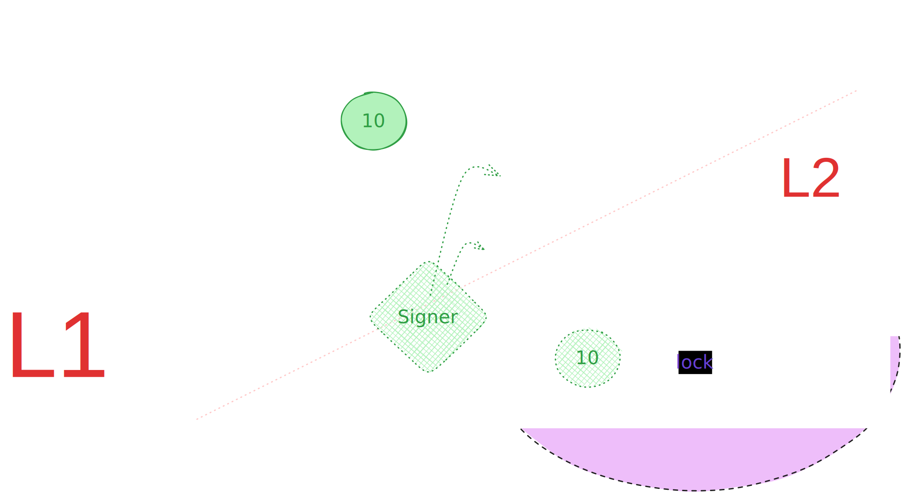

## Workflow

- TokenFactory will deploy `L1Tokens`
- We have both `L1` and `L2`
- `L1` can be Ethereum and `L2` can be ZK-Sync or viceversa
- `L1BossBridge` will be one of the main contract
- `L1BossBridge` will be responsible for sending `L1Tokens` to `L1Vault`
- `L1Vault` is reposible to hold the tokens and sending them back whenver needed
  
- Let's say we sent 10 tokens to vault
- these `10 tokens` will be sent into the vault
- which means vault will lock 10 tokens
- They actually don't go over to L2
  
- On the `L2 vault` it has similar to L1 token which is `L2Token` and a vault
- an off chain node will be watching the L1 vault
- This off chain node is called `signers`
- when some tokens get locked into the `L1Vault`
- this off chain node, unlocks this L2 tokens from the L2Vault
- this L2 tokens will be used in the L2 chain

- Whenever L1Vault wants to unlock the L1 tokens
- This off chain node will lock the L2 tokens
- back into the L2 vault.
- now L1 vault can unlock the locked L1Tokens

---

- Each vault works with 1 token